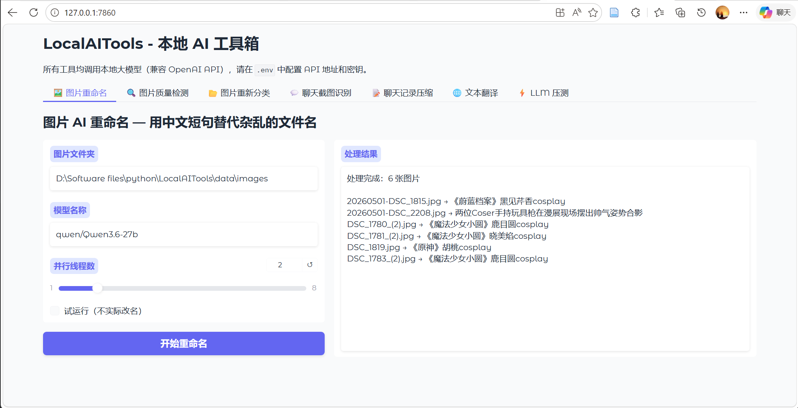

# LocalAITools - 本地 AI 工具箱

一套调用本地大模型（兼容 OpenAI API）的实用工具集合，涵盖图片处理、文本处理、性能测试。支持 **LM Studio / Ollama / vLLM / 云端 API**。

- **图形界面**：一行命令启动 Web UI，无需敲代码
- 
- **命令行**：每个工具也可独立运行，方便脚本集成
- **统一配置**：所有工具的 API 地址、模型名称、参数集中在 `.env` 文件中管理

---

## 工具一览

| 工具 | 功能 | 说明 |
|------|------|------|
| 图片重命名 | `image_tools/rename_images.py` | 视觉模型理解图片内容，自动生成中文短句文件名 |
| 质量检测 | `image_tools/detect_ai_errors.py` | 四维度 AI 评分（真实感/艺术性/细节/清晰度） |
| 重新分类 | `image_tools/reclassify_by_txt.py` | 基于评分 txt 将图片分入高质量/低质量子文件夹 |
| 截图识别 | `image_tools/explain_images_txt.py` | 聊天记录长截图切片后 VLM 逐条识别输出文字 |
| 文本精简 | `text_tools/explain_txt.py` | 超长聊天记录 txt 合并冗余时间戳，输出紧凑格式 |
| 文本翻译 | `text_tools/translate.py` | 长篇小说按章节切分翻译，支持断点续传 |
| 章节摘要 | `text_tools/chapter_summary.py` | FAISS + BM25 混合检索，多轮迭代问答 |
| 性能压测 | `benchmarks/speedtest.py` | LLM 吞吐量测试，TTFT/ITTL 统计，绘制折线图 |

---

## 快速开始

### 1. 启动本地模型服务

确保本地运行着 OpenAI 兼容的 API：

- **LM Studio**：[下载](https://lmstudio.ai/) → 加载模型 → 启动 Local Server（默认 `http://localhost:1234/v1`）
- **Ollama**：`ollama serve`（默认 `http://localhost:11434/v1`）
- 或任何 OpenAI 兼容 API

### 2. 安装

```bash
git clone https://github.com/go-farther-and-farther/LocalAITools.git
cd LocalAITools
pip install -r requirements.txt
```

### 3. 配置

```bash
cp .env.example .env
# 编辑 .env，填入你的 API 地址和密钥
# 如果用本地 LM Studio，默认配置通常无需修改
```

### 4. 启动图形界面

```bash
python app.py
# 浏览器打开 http://localhost:7860
```

### 5. 命令行用法（示例）

```bash
# 图片 AI 重命名
python image_tools/rename_images.py -i data/images -w 4

# 图片质量检测
python image_tools/detect_ai_errors.py data/images

# 按评分重新分类
python image_tools/reclassify_by_txt.py data/images

# 聊天截图 → 文字
python image_tools/explain_images_txt.py -i data/screenshots

# 聊天记录精简
python text_tools/explain_txt.py -i data/screenshots/texts

# 长篇翻译
python text_tools/translate.py -i data/texts/novel.txt -w 4

# API 性能压测
python benchmarks/speedtest.py --url http://localhost:1234/v1 --model qwen3.6-35b
```

---

## 目录结构

```
LocalAITools/
├── app.py                  # Gradio Web 界面入口
├── config.py               # 统一配置模块
├── .env.example            # 配置模板（复制为 .env）
├── requirements.txt
│
├── data/                   # 默认输入目录
│   ├── images/             #   图片重命名、质量检测用
│   ├── screenshots/        #   聊天截图识别用
│   │   └── texts/          #   聊天记录压缩用
│   ├── texts/              #   翻译输入用
│   └── models/             #   HuggingFace 缓存
│
├── outputs/                # 默认输出目录
│   ├── translation/        #   翻译输出 + 进度
│   ├── summaries/          #   章节摘要
│   └── benchmarks/         #   压测结果 + 图表
│
├── image_tools/            # 图片处理工具
├── text_tools/             # 文本处理工具
└── benchmarks/             # 性能测试
```

---

## 配置说明

编辑 `.env`（从 `.env.example` 复制）：

```bash
# API 连接
OPENAI_BASE_URL=http://localhost:1234/v1
OPENAI_API_KEY=lm-studio

# 模型名称
VISION_MODEL=qwen/qwen3.6-27b
TEXT_MODEL=qwen/qwen3.5-9b

# 输入/输出目录
DATA_DIR=data
OUTPUT_DIR=outputs

# 并发与重试
DEFAULT_WORKERS=2
RETRY_TIMES=2
```

全部配置项见 `.env.example` 中的中文注释。

---

## 典型场景

### 整理截图

```bash
# 1. 截图放到 data/images
# 2. AI 重命名
python image_tools/rename_images.py -i data/images
# 3. 质量检测
python image_tools/detect_ai_errors.py data/images
# 4. 按质量分拣
python image_tools/reclassify_by_txt.py data/images
```

### 整理聊天记录

```bash
# 1. 长截图放到 data/screenshots
# 2. OCR 提取文字
python image_tools/explain_images_txt.py -i data/screenshots
# 3. 精简格式
python text_tools/explain_txt.py -i data/screenshots/texts
```
